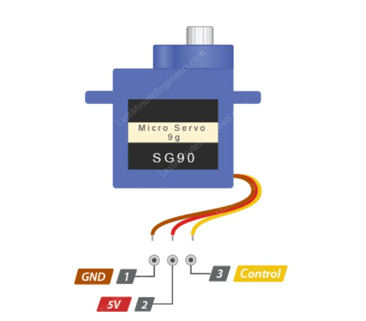

# four_in_one_demo_20140502

## Caracteristicas:
- Envia por el puerto serie la lectura del IR
- Funciones de avance, retroceso y giro con comando IR
- Comunicacion BT via HC06 por Serial Arduino

## Pinout:

- D2 -> irReceiverPin:Receptor de infrarrojos

- D3 -> servo (ver pinout mas abajo)

- D4 -> HC-05 Bluetooth TXD

- D5 -> pinI1: Motor Right I1
- D6 -> pinI2: Motor Right I2

- D7 -> HC-05 Bluetooth RXD

- D8 -> pinI3: Motor Left I3
- D9 -> pinI4: Motor Left I4

- D10 -> enb: Motor Left (EB control de velocidad PWM)

- D11 -> ena: Motor Right (EA control de velocidad PWM)

### Pinout SG 90

